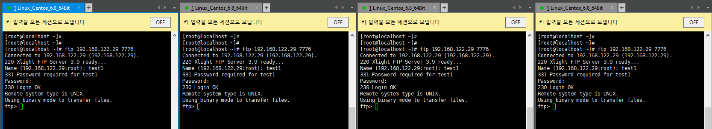
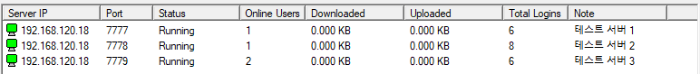

# FTP PROXY

> FTP 로드 밸런서 입니다.

여러 FTP 서버에 접속을 **부하분산** 시켜주는 프로그램입니다.
쉽게 생각하시면 HA-PROXY와 비슷한 기능을 합니다.

## 설치하기
1. `git clone https://github.com/zndn1997/test-proxy.git`
2. `cmake -DCMAKE_BUILD_TYPE=<build_type> ./` (`<build_type>`에는 Debug, Release 등이 있음.)
3. `cmake --build ./`
4. `proxy.cfg` 설정파일을 열어 다음과 같은 형식으로 FTP 서버를 등록합니다.
> `server_address IPADDRESS:PORT`
5. 방화벽이 실행되고 있다면 방화벽 설정을 해주세요
6. `proxy.cfg` 파일을 실행파일 위치로 이동합니다  
> `mv proxy.cfg Release/`
7. 빌드된 결과 파일을 실행합니다.

### 설치전 유의사항
> CMAKE 3.8 이상 버전이 필요합니다.
> GCC 4.4 이하 버전에서는 `ftp-proxy/CMakeLists.txt`에서 `target_compile_options`의 `-std`값을 [`-std=c90` -> `-std=gnu89`]로 변경하여야 합니다.

## 사용 방법
1. `proxy.cfg` 에 FTP 서버를 등록합니다.
> 이때 FTP 서버의 인증정보 및 데이타 서버는 모두 동일해야합니다.
2. proxy를 실행중인 서버의 주소:21 번 으로 FTP 접속을 합니다.

## 동작 모습
> 본 테스트 환경의 FTP SERVER 는 [Xlight FTP Server](https://www.xlightftpd.com) 프로그램을 이용하여 구축하였습니다

  
PROXY 가 실행중인 주소로 FTP USER를 동시에 접속시도하니 FTP PROXY 가 부하분산을 하여 FTP SERVER 에 유저가 골고루 접속된 모습입니다.

### 사용 시 주의사항
방화벽 설정에 따라 프로그램이 동작하지 않을 수 있습니다.

## 기여하기
버그등이 발생할 경우 이슈로 등록해 주시거나, 문제가 되는 부분을 수정하신 후 PR해 주시면 감사하겠습니다.

## 라이센스
이 라이브러리는 [MIT 라이센스](https://github.com/zndn1997/test-proxy/blob/master/LICENSE)를 따라 자유롭게 이용하실 수 있습니다.

